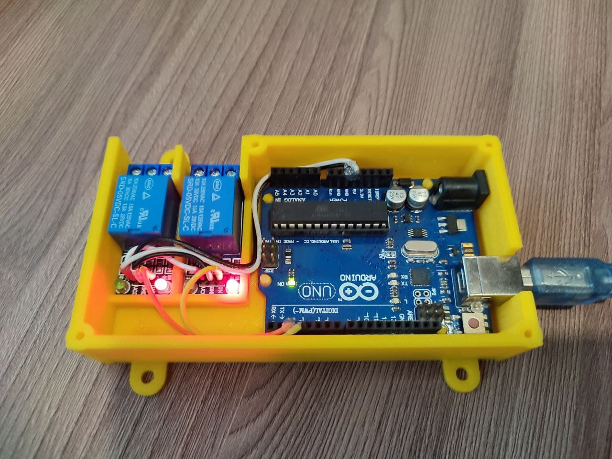

# Observatory Roof Controller

[](https://github.com/miksrv/indi-rollroof-controller/actions/workflows/arduino-check.yml) 
[](https://github.com/miksrv/indi-rollroof-controller/actions/workflows/cmake-multi-platform.yml)

A fork of the original [INDI Aldiroof](https://github.com/dokeeffe/indi-aldiroof) project by Derek O'Keeffe, designed for simplified roll-off roof mechanisms requiring only two signals: **OPEN** and **CLOSE**.

This project includes an [INDI](http://indilib.org/) driver and Arduino firmware to manage a roll-off roof for astronomical observatories.


## Key Features

- **Efficient Roof Operation**: Control a motor-driven sliding gate reducer with just two signals.
- **Hardware Safety**: Includes limit switches for roof position and reed switches for telescope parking.
- **Simple Electronics**: Two 30A relays connected to an Arduino handle all roof movements.
- **Seamless Communication**: Uses the Firmata protocol for interaction between the Arduino and the INDI driver.


## Hardware Requirements

### Components
- **Microcontroller**: Arduino UNO (or compatible board).
- **Relays**: Two 30A relay modules.
- **Sensors**: Limit switches and reed switches for positional feedback.
- **Server**: A Linux-based machine running the INDI server.
- *(Optional)* A custom 3D-printed case for the hardware.

## Software Setup

### 1. Flashing the Arduino Firmware
1. Open the [Arduino IDE](https://www.arduino.cc/en/software).
2. Connect your Arduino board to your computer.
3. Navigate to the `arduino-firmware/RoofController` directory.
4. Open `RoofController.ino` and upload the firmware.

### 2. Building and Installing the INDI Driver

1. **Install Required Dependencies**  
   Make sure your system is up to date and install the necessary libraries:
   ```bash
   sudo apt-get update
   sudo apt-get install -y cmake libindi-dev libnova-dev
   ```

2. **Clone the Repository**  
   Clone this project to your machine:
   ```bash
   git clone <repository-url>
   cd <repository-directory>
   ```

3. **Build and Install the Driver**  
   Run the provided script:
   ```bash
   chmod +x ./indi-rollroof/install.sh
   ./indi-rollroof/install.sh
   ```
   This script will:
   - Create a `build` directory.
   - Configure the driver using `cmake`.
   - Compile and install the driver via `make install`.

### 3. Configuring the INDI Web Manager
To integrate the driver with the INDI Web Manager:
1. Open `/usr/share/indi/drivers.xml` for editing:
   ```bash
   sudo nano /usr/share/indi/drivers.xml
   ```
2. Add this configuration under the `<Domes>` section:
   ```xml
   <device label="Roll Roof" manufacturer="miksoft">
     <driver name="Roll Roof">indi_rollroof</driver>
     <version>1.0</version>
   </device>
   ```
3. Save and restart the INDI Web Manager.

### 4. Wiring and Hardware Setup
- Wire the Arduino with relays, sensors, and motor as outlined in the [wiring diagram](./documentation/arduino-controller.jpg).
- Ensure that:
  - Limit switches are positioned to detect the fully open and closed states.
  - Reed switches confirm the telescope’s parked position before closing the roof.



## Contributing

Contributions are welcome! If you encounter bugs or have suggestions for improvements:
1. Fork the repository.
2. Create a feature branch.
3. Submit a pull request.

## Acknowledgments

This project is based on the work of [Derek O'Keeffe](https://github.com/dokeeffe/indi-aldiroof) and leverages the powerful [INDI Library](http://indilib.org/).  
Special thanks to the open-source community for enabling projects like this.

### License
This project is licensed under the [MIT License](./LICENSE).
